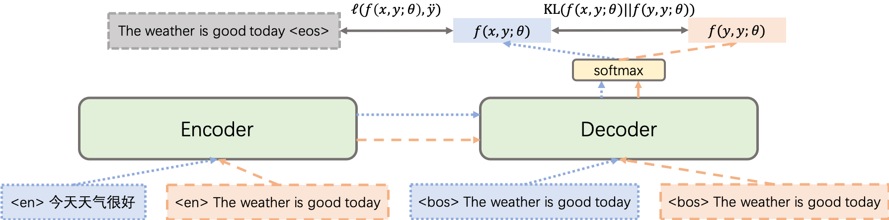

# Improving Zero-shot Multilingual Neural Machine Translation by Leveraging Cross-lingual Consistency Regularization

This repository contains the PyTorch implementation (**Unofficial**) for our Findings of ACL 2023 paper "[Improving Zero-shot Multilingual Neural Machine Translation by Leveraging Cross-lingual Consistency Regularization](https://arxiv.org/abs/2305.07310)".



## Requirements and Installation

This work has been tested in the following environment.

* Python version == 3.7.0
* PyTorch version == 1.11.0
* Fairseq version == 0.12.2


## Reproduction

The following instructions can be used to train a Transformer model on the IWSLT'17 Multilingual English-centric dataset.

### Preprocessing

Download the [training and development sets](https://wit3.fbk.eu/2017-01) (2017-01-trnmted.tgz) and the [evaluation sets](https://wit3.fbk.eu/2017-01-b) (2017-01-mted-test.tgz) for the IWSLT'17 multilingual task, which releases a multilingual corpus in five languages: English (en), German (de), Dutch (nl), Romanian (ro), and Italian (it).

Preprocess the data:

```
# Prepare the multilingual English-centric data
bash prepare-iwslt17-multilingual.sh

# Preprocess/binarize the multilingual English-centric data
TEXT=iwslt17.tokenized
fairseq-preprocess --source-lang src --target-lang tgt \
    --trainpref $TEXT/train --validpref $TEXT/valid \
    --destdir data-bin/iwslt17.tokenized \
    --joined-dictionary --workers 20
```

### Training

Pretrain the Transformer multilingual translation model over the English-centric data:

```
EXP=iwslt17_baseline
DATA=data-bin/iwslt17.tokenized

mkdir -p checkpoint/$EXP
mkdir -p log/$EXP

CUDA_VISIBLE_DEVICES=0,1,2,3,4,5,6,7 fairseq-train $DATA \
    --user-dir ./user_src \
    --arch transformer_wmt_en_de --share-all-embeddings \
    --optimizer adam --adam-betas '(0.9, 0.98)' --clip-norm 0.0 \
    --lr-scheduler inverse_sqrt --warmup-init-lr 1e-07 --warmup-updates 4000 \
    --lr 0.0007 --stop-min-lr 1e-09 --dropout 0.3 \
    --criterion label_smoothed_cross_entropy --label-smoothing 0.1 --weight-decay 0.0 \
    --max-tokens 4096 --fp16 --no-epoch-checkpoints --save-dir checkpoint/$EXP \
    1>log/$EXP/log.out 2>log/$EXP/log.err
```

Finetune the Transformer multilingual translation model over the English-centric data with CrossConST:

```
EXP=iwslt17_crossconst_alpha025
DATA=data-bin/iwslt17.tokenized
CKPT=checkpoint/iwslt17_baseline/checkpoint_best.pt

mkdir -p checkpoint/$EXP
mkdir -p log/$EXP

CUDA_VISIBLE_DEVICES=0,1,2,3,4,5,6,7 fairseq-train $DATA \
    --user-dir ./user_src \
    --arch transformer_wmt_en_de --share-all-embeddings \
    --optimizer adam --adam-betas '(0.9, 0.98)' --clip-norm 0.0 \
    --lr-scheduler inverse_sqrt --warmup-init-lr 1e-07 --warmup-updates 4000 \
    --lr 0.0007 --stop-min-lr 1e-09 --dropout 0.3 \
    --criterion label_smoothed_cross_entropy_with_crossconst --alpha 0.25 --label-smoothing 0.1 --weight-decay 0.0 \
    --reset-optimizer --reset-meters --reset-dataloader --reset-lr-scheduler --restore-file $CKPT \
    --max-tokens 4096 --fp16 --no-epoch-checkpoints --save-dir checkpoint/$EXP \
    1>log/$EXP/log.out 2>log/$EXP/log.err
```

### Evaluation

Evaluate our trained model on English to German translation direction (as an example):

```
# Prepare the English to German testset
bash prepare-iwslt17-testset.sh

# Preprocess/binarize the English to German testset
TEXT=iwslt17.tokenized.test
fairseq-preprocess --source-lang src --target-lang tgt \
    --testpref $TEXT/test \
    --destdir data-bin/iwslt17.tokenized.en-de \
    --srcdict data-bin/iwslt17.tokenized/dict.src.txt --tgtdict data-bin/iwslt17.tokenized/dict.tgt.txt --workers 20

# Evaluate the English to German translation direction
DATA=data-bin/iwslt17.tokenized.en-de
REF=iwslt17.tokenized.test/tmp/test.en-de.ref.de
EXP=iwslt17_crossconst_alpha025
CKPT=checkpoint/$EXP/checkpoint_best.pt

mkdir -p evaluation

CUDA_VISIBLE_DEVICES=0 fairseq-generate $DATA --path $CKPT \
    --gen-subset test --beam 5 --lenpen 0.6 --max-tokens 8192 --remove-bpe \
    > evaluation/$EXP

FILE=evaluation/$EXP

cat $FILE | grep -P "^D" | sort -V | cut -f 3- > $FILE.tok

MOSES=mosesdecoder
DETOK=$MOSES/scripts/tokenizer/detokenizer.perl

perl $DETOK -l de < $FILE.tok > $FILE.detok

sacrebleu -w 2 $REF < $FILE.detok
```

### Result

Please note that the experimental result is slightly different from that in the paper.

| Method | de -> it | de <- it | de -> nl | de <- nl | de -> ro | de <- ro | it -> ro | it <- ro |
| --- | --- | --- | --- | --- | --- | --- | --- | --- |
| Pivot | 18.83 | 18.85 | 20.04 | 20.28 | 16.23 | 18.27 | 19.86 | 22.93 |
| m-Transformer | 17.61 | 17.29 | 19.46 | 20.06 | 15.99 | 16.66 | 18.66 | 21.85 |
| &emsp; + CrossConST | 18.42 | 19.12 | 20.20 | 20.58 | 16.39 | 17.94 | 21.34 | 23.53 |

| Method | it -> nl | it <- nl | nl -> ro | nl <- ro | en -> de | en <- de | en -> it | en <- it |
| --- | --- | --- | --- | --- | --- | --- | --- | --- |
| Pivot | 22.86 | 22.12 | 18.08 | 20.38 | - | - | - | - |
| m-Transformer | 20.51 | 20.23 | 16.99 | 18.45 | 24.72 | 28.80 | 35.40 | 38.41 |
| &emsp; + CrossConST | 22.10 | 21.37 | 17.82 | 20.68 | 25.08 | 28.68 | 34.95 | 38.56 |

| Method | en -> nl | en <- nl | en -> ro | en <- ro |
| --- | --- | --- | --- | --- |
| Pivot | - | - | - | - |
| m-Transformer | 31.57 | 33.89 | 26.39 | 32.69 |
| &emsp; + CrossConST | 31.96 | 33.40 | 26.77 | 33.08 |

The overall performance is summarized as follows.

| Method | Supervised Average | Zero-shot Average | 
| --- | --- | --- |
| Pivot | - | 19.89 |
| m-Transformer | 31.48 | 18.65 |
| &emsp; + CrossConST | 31.56 | 19.96 |

## Citation

If you find the resources in this repository helpful, please cite as:
```
@inproceedings{gao-etal-2023-improving,
    title = "Improving Zero-shot Multilingual Neural Machine Translation by Leveraging Cross-lingual Consistency Regularization",
    author = "Gao, Pengzhi  and
      Zhang, Liwen  and
      He, Zhongjun  and
      Wu, Hua  and
      Wang, Haifeng",
    booktitle = "Findings of the Association for Computational Linguistics: ACL 2023",
    month = jul,
    year = "2023",
    address = "Toronto, Canada",
    publisher = "Association for Computational Linguistics",
    url = "https://aclanthology.org/2023.findings-acl.766",
    pages = "12103--12119",
    abstract = "The multilingual neural machine translation (NMT) model has a promising capability of zero-shot translation, where it could directly translate between language pairs unseen during training. For good transfer performance from supervised directions to zero-shot directions, the multilingual NMT model is expected to learn universal representations across different languages. This paper introduces a cross-lingual consistency regularization, CrossConST, to bridge the representation gap among different languages and boost zero-shot translation performance. The theoretical analysis shows that CrossConST implicitly maximizes the probability distribution for zero-shot translation, and the experimental results on both low-resource and high-resource benchmarks show that CrossConST consistently improves the translation performance. The experimental analysis also proves that CrossConST could close the sentence representation gap and better align the representation space. Given the universality and simplicity of CrossConST, we believe it can serve as a strong baseline for future multilingual NMT research.",
}
```
